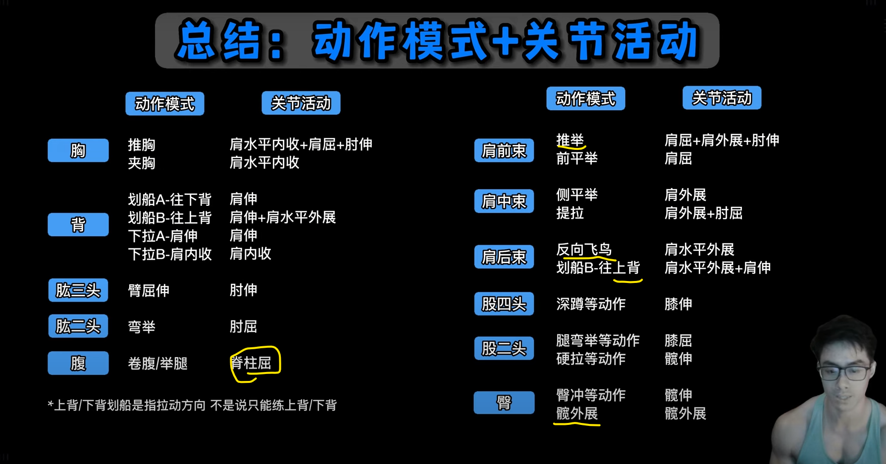

## Current Problem：

* leg day 之后体姿很好，但是upper day 却后退了，看来是农夫走，和深蹲时候，缩紧肩胛骨的功劳， uppder day 需要调整，或者face pull的原因——是face pull 的原因
* 一节课就是40-60分钟，教练再次提醒我，我的时间绝对有问题，或者是效率
* 核心太差，腰腹两个地方都不行
* 髋部灵活性
* 训练时间太长，过度
* 训练的质量和强度远比训练时间长短更重要。

## What I Want

### Explosive Power

天性

NFL 后卫，外接手，安全卫

### 对身体控制力，像跑酷、街头健身的单杠玩家

### 抓举动作

教练便宜，教我练习举重 抓举等等。髋部灵活性优先

### Enough Strength

不需要太大的重量作为目标，thib也说过，外胚型的关节太小，施加不了太大的压力；

更多的负重，更多的压力——不够健康

手臂太弱了，肱二头肌作为 “钩子”力量太弱了

左右不平衡 力量差距非常大

### Hiit

适合减肥

似乎也适合自己喜欢的节奏，充满变化

### 更多的投掷动作

## 每节课最好不要超过四个动作

## 要有孤立训练

thib、 dave tate 都提到孤立训练来补充每个人的缺点，而且必须是个性化的，每个人的优点和弱点是不同的。

## 似乎很多人在HP mass 组件 作为辅助练习 背阔肌、三角肌后束和菱形肌

example 1 :

> I added in some lat, rear delt, and romboid work between every 2nd or 3rd set yesterday, and that worked well. My quads, adductors, and traps are sore today, but I expected that. Completed my first NC workout today as well toulck about 12-15 minutes or so.
> 昨天我每两组或三组之间加练背阔肌、三角肌后束和菱形肌，效果不错。今天我的股四头肌、内收肌和斜方肌酸痛，不过这在我预料之中。今天也完成了我的第一次 NC 训练，大概 12-15 分钟左右。

## 重要的是每节课进步

这不是开玩笑，或者哲学

# 每天练习高抓，这是最好的发展力量

* 其实还有硬拉，但是这两个动作相似

# best exercises

* Nothing will build those like the *snatch-grip high pull from the hang or blocks*. I've had people contact me saying that it changed the way their body looked in as little as two or three workouts!
  没有什么比悬挂或卧推的抓举高拉更能锻炼这些肌肉了。有人联系我，说只练了两三次，他们的身材就变好了！

  For the high pull, focus on exploding upwards with the *lower body and hips to create upward momentum*. Then pull the barbell violently toward your neck – anywhere between the nipple line and neck constitutes a high pull. Keep the bar close and the elbows high.
  高拉时，*重点在于下半身和臀部爆发性地向上，创造向上的动力*。然后猛烈地将杠铃拉向颈部——乳头线和颈部之间的任何位置都算高拉。保持*杠铃靠近，肘部抬高*。
  **Do sets of 3 to 5 reps.**

* Best Exercise To Get You Ripped 2. 让你拥有健美身材的最佳运动
   *farmer's walk carry.*农夫行走——thib 认为比 推车或雪橇更好——组间休息不超过1或者2分钟

* Best Exercise To Be A Solid Power Athlete 3. 成为力量型运动员的最佳训练
  *power snatch from the hang*——thib 多次强调

* Best Exercise To Build A Big Chest 4. 打造丰满胸部的最佳运动
  不是卧推是dip ，也就是双杠臂屈伸——这两样自己都不要做，都很危险，除非有文斯吉龙达 双杠

* Best Exercise To Get Strong 5. 增强体质的最佳运动
  *Deadlift*

* Best Exercise For The Time Constrained 6. 时间有限的最佳锻炼方式
  如果你每周只有10分钟的时间进行一次训练，而且只能做一项举重动作，你会做什么？*我会做5组，每组3-5次的挺举和推举*——具体来说，是先进行悬挂式力量挺举，然后进行借力推举——*每组之间休息60-75秒*。

* For athletes I' d say the *power snatch from blocks*. For regular individuals and bodybuilders, I' d go with *snatch grip deadlift and push press.*

## Thib 动作分类

| 类别                       | Primary                                                      | Secondary                                                    | Auxiliary                                                    | Remedial                                                     |
| -------------------------- | ------------------------------------------------------------ | ------------------------------------------------------------ | ------------------------------------------------------------ | ------------------------------------------------------------ |
| 股四头肌                   | 奥林匹克后蹲（站位与髋同宽，躯干垂直），力量举深蹲（宽站位，躯干做出中等幅度的前倾），前蹲 | 箭步蹲及其变化动作，训练凳搁腿深蹲及其变化动作，腿举，杠铃哈克深蹲，哑铃深蹲 | 机器哈克深蹲，迈上箱子及其变化动作，腿屈伸及其变化动作，西斯深蹲 | 端点伸膝（使用弹力带），弹力带腿屈伸                         |
| 腘绳肌、臀肌               | 罗马尼亚硬拉，直腿硬拉，相扑硬拉，抓举握法硬拉               | 早安式体前屈及其变化动作，glute-ham raise，腿举（双脚置于踏板比较靠上的位置） | reverse hyper，胯下钢索前上拉，腿弯举及其变化动作，钢索伸髋  | X带行走，库克提腿，健身球腿弯举，弹力带腿弯举                |
| 胸肌                       | 下斜卧推，卧推，吉龙达双杠臂屈伸                             | 上斜卧推，哑铃卧推，哑铃上斜卧推，对颈卧推                   | 钢索夹胸，飞鸟及其变化动作，蝴蝶机，坐姿推胸机               | 健身球俯卧撑，晃板俯卧撑                                     |
| 上背部、三角肌后束         | 反手引体向上及其变化动作，正手引体向上及其变化动作，胸部支撑划船，俯身杠铃划船，T杠划船 | 单臂哑铃划船，T杠下拉及其变化动作，钢索坐姿划船及其变化动作，墙角划船，胖子引体向上（反式划船），坐姿对颈绳子握柄划船 | 直臂下拉，钢索仰卧直臂上拉，高位滑轮交叉划船，低位滑轮交叉划船，机器坐姿划船，机器背阔肌下拉，俯身侧平举，机器反飞鸟，胸部支撑上斜俯身侧平举 | 胸部支撑上斜哑铃耸肩，坐姿钢索耸肩（肩胛骨缩回），上斜俯卧平举 |
| 肩部                       | 肌肉挺举，（站姿杠铃）肩上推举，借力推举，坐姿杠铃肩上推举   | 坐姿及站姿哑铃肩上推举及其变化动作，阿诺德推举，斯科特/Thib推举，肌肉抓举 | 机器肩上推举，侧平举及其变化动作，前平举及其变化动作，侧平举机 | 古巴推举，肩外旋                                             |
| 手臂屈肌（肱二头肌、肱肌） | 站姿杠铃弯举，牧师凳杠铃弯举                                 | 锤式弯举，坐姿哑铃弯举及其变化动作，牧师凳哑铃弯举，正握杠铃弯举（站姿或使用牧师凳），Zottman弯举 | 机器弯举，钢索弯举及其变化动作，集中弯举                     | 长柄锤或托尔之锤前臂转动（肘部紧贴体侧，弯曲90度，手握锤柄下半段。在起始动作中，采用正握，即掌心向下，拇指向内。接下来，肘部不动，转动前臂。一直转到掌心向上，拇指向内。） |
| 肱三头肌                   | 窄握卧推，窄握下斜握推，体后臂屈伸                           | 窄握上斜卧推，反握卧推，JM卧推，下斜杠铃臂屈伸，下斜哑铃臂屈伸，平板杠铃臂屈伸，平板哑铃臂屈伸 | 颈后哑铃臂屈伸，颈后杠铃臂屈伸，颈后钢索臂屈伸及其变化动作，臂屈伸机 | 健身球窄握俯卧撑，晃板窄握俯卧撑                             |

## 动作模式 关节活动

## 6 foundational movement patterns

- Squat: Barbell Front Squat，Barbell Front Squat
- Hip Hinge: Deadlift ，**Trap Bar Deadlift**
- Lunge: 
- Upper Body Press: 
- Upper Body Pull: 
- Loaded Carry: 

|                  |                                  |                                                              |
| ---------------- | -------------------------------- | ------------------------------------------------------------ |
| Squat            | BB Front Squat，BB Front Squat   |  |
| Hip Hinge        | Deadlift ，**Trap Bar Deadlift** |  |
| Lunge            |                                  |  |
| Upper Body Press |                                  |  |
| Upper Body Pull  |                                  |  |
| Loaded Carry     |                                  |  |

