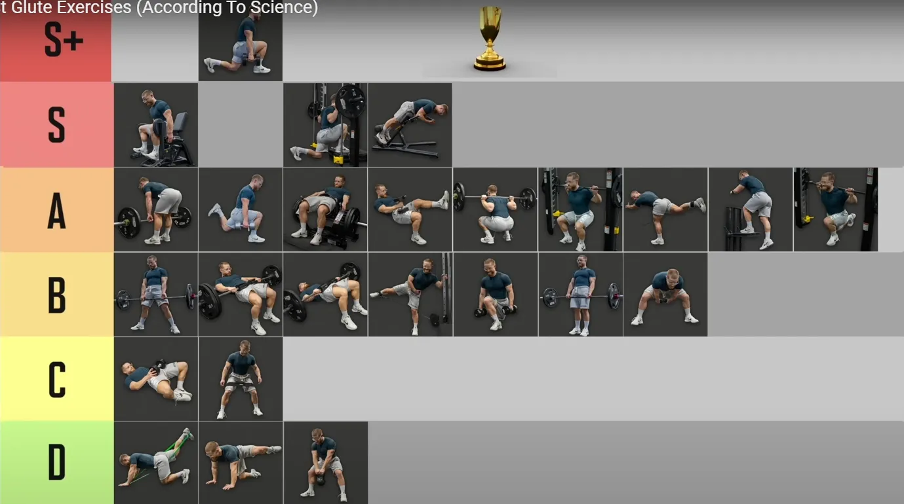
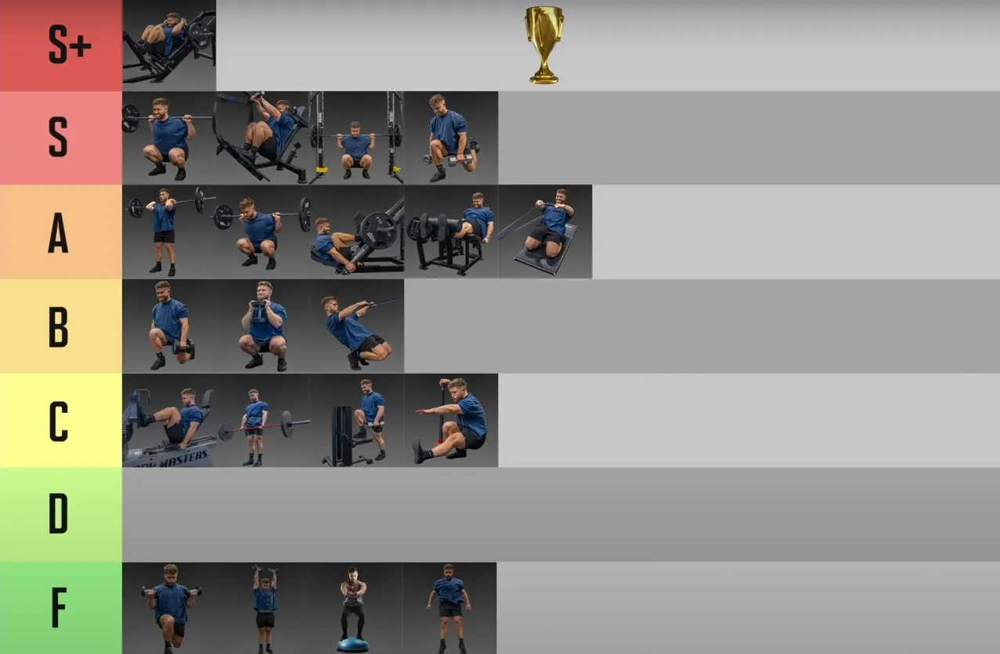

今天锻炼后蹲，前蹲还没恢复过来

## plan

没什么可改变的，就是多组深蹲，

1. warm up 
   1. 参考warm up.md
   2. 高脚杯深蹲
   3. Snath or  Clean as Beginning
2. 第一个、第二个动作，也可以作为超级组——关注速度，而不是爆发力，每一组都可以加重、减重 ，随意一点。
   1. **哑铃前平举** 激活 核心
   2. 前蹲+箭步蹲 / 后蹲(抓举握法硬拉)+ 单腿硬拉——除了试探组，加重都算正式组，杠铃片加减以10磅为单位。
   3. 抓举握法硬拉——提升背部肌肉
3. weighted 山羊挺身——用器械孤立臀部训练，kack back，腰部不堪重负
4. 考虑 push press
5. face pull
6. 农夫走+卷腹
   1. 农夫走：臀部夹紧，收腹，肩胛骨收紧就像能夹住花生米，同时能锻炼前臂 
7. 拉伸，髋部柔韧性

|                                                              | 休息与力竭                                 |      |
| ------------------------------------------------------------ | ------------------------------------------ | ---- |
| 深蹲 前蹲 trap-bar                                           | 3-5分钟，3-5次，爆发力，高组数，力竭前停止 |      |
| 背部——双杠 每组2次 要轻松完美完成 ， t杠，斜上方拉；最后选水平划船 | 3分钟一下，背部以控制为主，                |      |
| 腹部 或 山羊挺身                                             |                                            |      |
| face pull                                                    |                                            |      |
| 农夫走                                                       |                                            |      |

## Tips

除了试探组都是正式组，杠铃片加减以10磅为单位。——参考thib 体系

## 继续用swing 做热身

我自己深蹲成绩没进展也许与没有继续练习这个有关

壶铃与哑铃摆举也是非常好的变化动作。它们不仅能够训练你的*下背部、腘绳肌、臀部，还能够充分刺激你的斜方肌*。

### 周六leg day ，周日 upper

* 因为周六人最多，上肢动作多，器械安排不上，深蹲只需要一个器械
* 周日几乎没人

### christian thibaudeau, 我大多数时候只采用这3个双腿力量训练动作：

> * 后蹲
>* 前蹲
> * Trap-bar硬拉
> 
> 但是，大多数的下肢训练课上，我只练习后蹲，至少做12个正式组。

## 高脚杯深蹲

## Exercises

### Snath or  Clearn as Beginning

* *snatch grip deadlift*_thib 推荐所有普通人用这个来替代举重台高抓
* 血与镁粉 对于增大斜方肌有效，而且他从不练习耸肩，他的斜方肌比90%的人要好
* Thib 也是强烈推荐
* 作为开始动作是因为，这是个爆发力动作, 对神经要求也高

### Trap Bar

* 安全， thib 也练习这个
* Hinge

### ~~DeadLift~~

* 西部杠铃练习的是能提升硬拉成绩的动作，而不是硬拉本身这个动作——在进化史第5章

  > 他们提高硬拉的方法是动力深蹲训练日，Glute-ham raise，胯下钢索前上拉，体前屈，架上拉，以及大量的大重量腹肌训练。
* not good for back
* Hinge
* **trap bar 替代**
* **抓举握法硬拉**？
* 对抓举动作有帮助

### Single Leg

*注意肩部不要往前，会导致疼痛*

* 这一类都在thib的*Secondary*里面，作为*第二个或第三个动作*

* 功能性

* Lunge of  6 patterns

* 单腿罗马尼亚硬拉——这个是我感觉体姿最明显的，如果器械被占用，练习这个

  考虑：**弓步 (Lunges)：** 改善单腿力量和平衡。

难度排行

1. Split Squat
2. **Back Foot Elevated Split Squat——保加利亚分腿蹲**—— Bulgarian split squat——非常多的运动研究推荐这个动作
3. Front Foot Elevated Split Squat
4. ~~**Reverse Lunge**——肩部不稳导致疼痛，暂时不做~~——*用史密斯机做分腿蹲或脚后置箭步蹲*
5. ~~Forward Lunge~~ ——对膝盖压力大
6. **Single Leg Deadlift**

### 农夫走& 腹肌

*注意肩部不要往前，会导致疼痛*

减脂：农夫走+腹肌钢索卷腹——臀部夹紧，收腹，肩胛骨收紧就像能夹住花生米，同时能锻炼前臂 

* Carry of  6 patterns

### 山羊挺身

---

## Best Exercises 

> ~~Hip thrust~~ 要被排除——自我感觉不好，虚假的重量成绩，下背部不适，有专门的文章说大重量hip thrust对背部不好，thib明确说明不给任何客户这个计划，没有见到任何nfl，nba，短跑运动员做这个动作的视频。

###  Thib: Primary, Secondary

| 类别         | Primary                                                      | Secondary                                                    | Auxiliary                                                    | Remedial                                      |
| ------------ | ------------------------------------------------------------ | ------------------------------------------------------------ | ------------------------------------------------------------ | --------------------------------------------- |
| 股四头肌     | 奥林匹克后蹲（站位与髋同宽，躯干垂直），力量举深蹲（宽站位，躯干做出中等幅度的前倾），前蹲 | **箭步蹲**及其变化动作，**训练凳搁腿深蹲**及其变化动作，腿举，杠铃哈克深蹲，**哑铃深蹲** | 机器哈克深蹲，**迈上箱子及其变化动作**，腿屈伸及其变化动作，西斯深蹲 | 端点伸膝（使用弹力带），弹力带腿屈伸          |
| 腘绳肌、臀肌 | 罗马尼亚硬拉，直腿硬拉，相扑硬拉，抓举握法硬拉               | **早安式体前屈及其变化动作**，glute-ham raise，腿举（双脚置于踏板比较靠上的位置） | **reverse hyper**，胯下钢索前上拉，腿弯举及其变化动作，钢索伸髋 | X带行走，库克提腿，健身球腿弯举，弹力带腿弯举 |

###  盖伊 三人组

#### Quad 

高杠深蹲，高杠深蹲，**保加利亚单腿深蹲**(盖伊)

#### Glute

臀推，臀推，硬拉

###  Athlean-X

#### Quad 

* best：Front Squats , Belt Squats  
* almost best：Hack Squats ， **Bulgarian Split Squats** ， High Bar Back Squats ， **DB / BB Reverse Lunge**

#### Glute

* best： barbell hip thrust
* almost best：  cable pull through， **DB leaning step up**， gluteus bridge curl / gluteus ham rises.， Slick floor bridge curl ，**Barbell RDL's** ， low bar squats.      

### Jeff Nippard -The Best & Worst

####  Glute 

> S ：*machine hip abduction*，walking lunge，*smith lunge*——整个S系列让我困惑，machine太简单，lunge对膝盖要求很高
>
> S：*45度负重山羊挺身*
>
> A ：Machine Hip thrust, single-leg db thrust, BB back squat，保加利亚 split squat，kickback，step up
>

#### Quadriceps

>S : Back squat,  hack squat（肩膀间距除非可调节，否则不做），pendulum squat，**保加利亚split squat**
>
>A：前蹲，45度腿举，leg extension(健身房有)

###  Bret Contreras

The Best Damn Hip, Leg, and Calf Workout 

Based on the results of this experiment, I bet the following would be one kick-ass workout that’d target the quads, hamstrings, glutes, and calves. Enjoy!
根据本次实验的结果，我敢打赌，以下训练计划一定会非常有效，能够有效锻炼股四头肌、腘绳肌、臀肌和小腿肌肉。尽情享受吧！

- Quads: Full Squat, Parallel Squat, Half Squat, or Quarter Squat
  四头肌： 全蹲、平行蹲、半蹲或四分之一蹲
- Hamstrings: Deadlift or Rack Pull
  腿筋： 硬拉或架上拉
- Glutes: Barbell Glute Bridge, Hip Thrust, Pull Through
  臀部： 杠铃臀桥、臀推、臀桥
- Calves: Heavy Calf Raise
  小腿： 重物提踵
