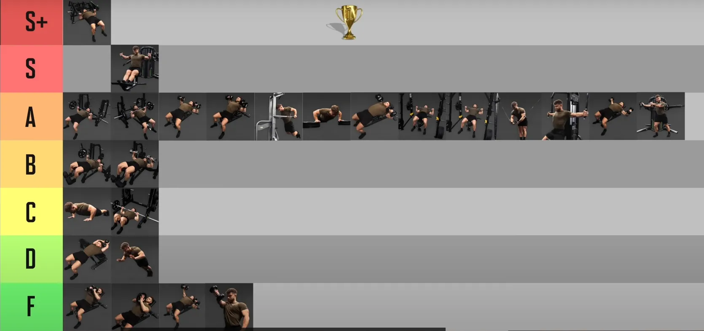
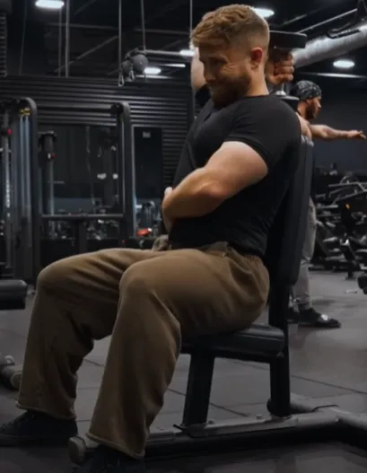

## 为什么 chest , 三角肌，肱三头肌放一起

* 都属于上体推类 
* thib ， jim 把这些都放在一起，确实考虑到训练经济性也应该放在一起
* 上体press 大肌群是 chest，主要也要练习他，其他事辅助动作
* 现在，至于辅助训练，你必须分析一下卧推，看看哪些肌肉将会帮助你取得提高。起**主要作用的肌肉是胸部，肩部和肱三头肌。起次要作用的肌肉是背阔肌，上背部和肱二头肌**。现在，由于我是训练经济性的支持者，我只选择最有效的训练动作。——血与镁粉

## 双杠臂屈伸

**双杠臂屈伸**——兼顾负重和不负重的动作。我很重视这个动作，我感觉**它是我尝试过的最佳上肢动作之一**——血与镁粉

对于发展胸部dip 超过 卧推——thib

## 卧推辅助动作——血与镁粉

* 双杠臂屈伸
* 站姿推举——换成借力推举
* 哑铃卧推
* 负重俯卧撑
* Face pull（图片见血与镁粉之一）和俯身侧平举都是好动作，但难以使用大重量，这就使得它们更接近于补充性训练和结构整体性训练。
  **千万不要试图做极限重量的face pull，或者使用80磅的哑铃做俯身侧平举。不要。**
* *为提高卧推重量而发展上背部*——注意前提，我发现划船的一些变化动作最有效。我喜欢正手和反手引体向上（我一直坚持练习），但只有划船才能够有效地帮助你提高卧推重量。诀窍是，划船时，向着身体较高的位置拉起杠铃，双肘稍微张开。不要向着腹部拉起杠铃。**我推荐俯身划船，哑铃划船，以及TC（译注：教练，TMUSCLE网站编辑）最喜欢的动作——T杠划船。**
* **至于肱二头肌——练习杠铃弯举**。这里没有什么革命性的发现。你只需要像老虎一样用力做就可以了。
* 总之——身体前部要强壮有力，身体后部围度要大，要稳固。

# Push

thib 一年训练卧推不超过三个月

##  计划

###  胸部动作

* 杠铃哑铃上斜
* 单手双手cable crossover
* 蝴蝶机

###   Triceps 

* *练习哑铃，直至单手10kg再用ez 或者 t杠*
* cable bar overhead
* 杠铃平板
* cable 下压
* 哑铃平板，单手坐姿

##  Thib

| 类别     | Primary                                                    | Secondary                                                    | Auxiliary                                                    | Remedial                         |
| -------- | ---------------------------------------------------------- | ------------------------------------------------------------ | ------------------------------------------------------------ | -------------------------------- |
| 胸肌     | 下斜卧推，卧推，吉龙达双杠臂屈伸                           | 上斜卧推，哑铃卧推，哑铃上斜卧推，对颈卧推                   | 钢索夹胸，飞鸟及其变化动作，蝴蝶机，坐姿推胸机               | 健身球俯卧撑，晃板俯卧撑         |
| 肩部     | 肌肉挺举，（站姿杠铃）肩上推举，借力推举，坐姿杠铃肩上推举 | 坐姿及站姿哑铃肩上推举及其变化动作，阿诺德推举，斯科特/Thib推举，肌肉抓举 | 机器肩上推举，侧平举及其变化动作，前平举及其变化动作，侧平举机 | 古巴推举，肩外旋                 |
| 肱三头肌 | 窄握卧推，窄握下斜握推，体后臂屈伸                         | 窄握上斜卧推，反握卧推，JM卧推，下斜杠铃臂屈伸，下斜哑铃臂屈伸，平板杠铃臂屈伸，平板哑铃臂屈伸 | 颈后哑铃臂屈伸，颈后杠铃臂屈伸，颈后钢索臂屈伸及其变化动作，臂屈伸机 | 健身球窄握俯卧撑，晃板窄握俯卧撑 |

##  盖伊三人组：一个动作

chest：哑铃卧推、哑铃卧推、上斜**哑铃**卧推、

三头肌： cable 下拉，cable w杠下拉—— cable下拉真的是门槛非常非常低，非常容易上手，没有教练说的那么难；直杠或者w杠对**肩膀**和手腕友好，我的肩膀稳定度不好。

##  Athlean-X

###  chest

best：杠铃和哑铃卧推

almost best：Heavy 1 arm crossovers（越过中线，否则不是crossover），30 degree incline press

###  triceps

best：Lying tricep extension——ez bar or db

almost best：tricep kickback, incline db powerdombs，cable pushdown

##  [Inside the Muscles: Best Chest and Triceps Exercises](https://t-nation.com/t/inside-the-muscles-best-chest-and-triceps-exercises/284620)

by Bret Contreras

Based on the results of this experiment, I bet the following would be one kick-ass workout that’d target the upper, mid, and lower pecs as well as the triceps. Enjoy!
根据这次实验的结果，我敢打赌，下面的训练计划一定会非常有效，不仅能锻炼到上、中、下胸肌，还能锻炼到肱三头肌。好好享受吧！

- Guillotine Press or Dumbbell Bench Press
  断头台卧推或**哑铃卧推**
- Dumbbell Incline Press or Mid-Pulley Crossover
  哑铃**上斜卧推**或中**滑轮交叉训练**
- Weighted Dip or Fly
  负重双杠臂屈伸或飞鸟
- Rope Extension or Cable Extension ——三头肌
  **绳索下压或缆绳下压**

> DB press, DB incline press,  cable Crossover, 
> Rope Extension or Cable Extension 

##  The Best & Worst Chest Exercises 

by [Jeff Nippard](https://www.youtube.com/@JeffNippard)

|      |                                                              |
| ---- | ------------------------------------------------------------ |
| S+   | 平板卧推器械                                                 |
| S    | 第二个是cable 蝴蝶机，总之是自制的器械，不用关心。 S的第一个动作之所以是空白，是因为移动到上面去了 |
| A    | 哑铃和杠铃上斜与平板卧推（~~没有下斜~~），钢索，蝴蝶机，cable crossover, cable press around |

> 对我来说现在以及未来用的是
>
> * 杠铃上斜卧推，哑铃上斜卧推——杠铃关节受限，但是稳定性好于哑铃，看个人感觉练习
> * cable crossover, cable press around ——单臂和双臂钢索夹胸
> * 蝴蝶机——蝴蝶机的问题是需要肱二头肌，我目前不适合。
> * ~~S+的平板卧推器械很少见~~

##  The Best & Worst TRICEPS Exercises 

> **在肱三头肌练习中，bar 版本都要高于rope版本一个等级**
>
> S 的两个动作是一个是cable，一个是平板，如果cable被占用，
>
> A：1 Arm DB overhead extension，哑铃平板屈伸——类似S级别的杠铃版本
>
> 
>
> 

##  Push

| 动作                                     | 组数 × 次数     | 原因与注意                                                   |
| ---------------------------------------- | --------------- | ------------------------------------------------------------ |
| **上斜哑铃卧推**（主力）                 | 4组 × 8-10      | 自由度高、利于挺胸发力，肩膀下沉，配合呼吸控制。凳子倾斜30°最佳。 |
| **上斜大黄蜂器械 Press**                 | 3组 × 10-12     | 固定轨迹，适合更重负荷或更高代谢刺激，挺胸控制收缩。         |
| **坐姿蝴蝶机 / Pec Deck**                | 2-3组 × 12-15   | 孤立胸大肌，姿态安全，避免三角肌代偿，收缩顶点停顿1秒。      |
| **Seated Chest Press Machine（水平推）** | 2-3组 × 10-12   | 若体力允许，可作为结尾“收干净”肌群。注意肩膀别顶上去。       |
| **过头举重物 Farmer's Carry（非必须）**  | 1-2组 × 15~20米 | 可选。主要激活核心+胸廓稳定+肩胛下沉能力，对圆肩体姿略有帮助。选择10kg左右杠铃片，动作慢、控制住姿态。 |
| **腹部（Cable伐木）**                    | 3组 × 12-15     | 若前一日未练腹部，此处可补上，继续改善核心平衡、体姿问题。   |

【主力】上斜哑铃卧推（控制 + 感受）  
↓  
【次级】上斜器械Press（推爆 + 安全）  
↓  
【孤立】蝴蝶机（顶点收缩 + 姿势锁定）  
↓  
【辅助】Chest Press（中下胸补充，视疲劳情况）  
↓  
【可选】Overhead Farmer's Walk（控制性练习）  
↓  
【辅助】Cable伐木 or 悬垂腿举（核心 + 姿态修复）

